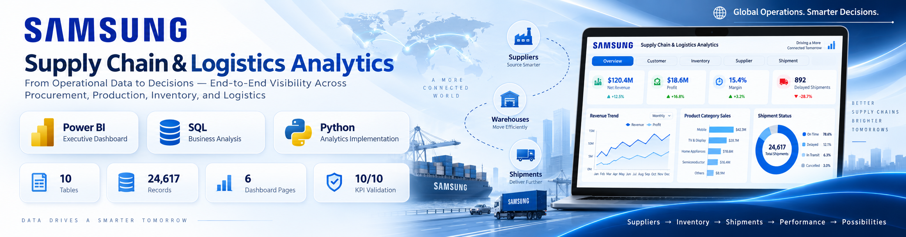
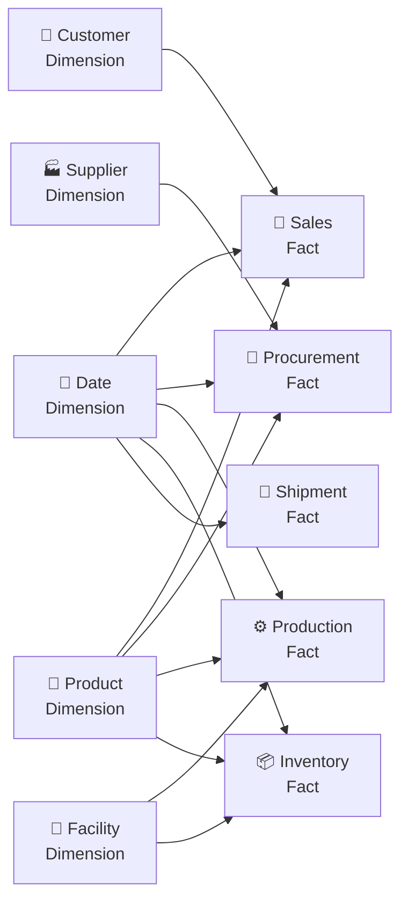
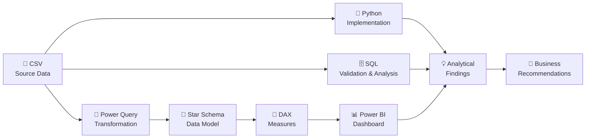

<div align="center">



# 🚚 Supply Chain & Logistics Analytics

### From operational data to management decisions across the end-to-end supply chain

<p>
  
  
  
  
  
</p>

<p>
  
  
  
  
  
</p>

<br>

<a href="Dashboard%20Pdf/dashboard.pdf">
  
</a>
&nbsp;
<a href="Business%20Report/SAMSUNG%20Supply%20Chain%20and%20Logistics%20Analytics%20Report.pdf">
  
</a>
&nbsp;
<a href="Sql%20File/business_insight_queries.sql">
  
</a>

<sub>Portfolio project by <b>Subachan Subedi</b></sub>

</div>

---

<p align="center">
  
</p>

<div align="center">

### 💰 $176.95M Net Revenue &nbsp;•&nbsp; 📈 $48.56M Profit &nbsp;•&nbsp; 🎯 27.44% Margin &nbsp;•&nbsp; 🧾 $78.13M Procurement Spend 
</div>

---

## 🧭 Quick Navigation

<p align="center">
  <a href="#-project-overview">Overview</a> •
  <a href="#-business-objective">Business Objective</a> •
  <a href="#-executive-scorecard">Scorecard</a> •
  <a href="#-dashboard-experience">Dashboard</a> •
  <a href="#-key-business-insights">Insights</a> •
  <a href="#-recommended-actions">Actions</a> •
  <a href="#-data-model--dataset">Data Model</a> •
  <a href="#-analytics-workflow">Workflow</a> •
  <a href="#-python-implementation">Python</a> •
  <a href="#-sql-validation--analysis">SQL</a> •
  <a href="#-tools--technologies">Tech Stack</a> •
  <a href="#-repository-structure">Repository</a>
</p>

---

# 📌 Project Overview

This project presents a **six-page Power BI analytics solution** built to explore a synthetic Samsung-style supply chain over a two-year operating period:

> **📅 January 2023 → December 2024**

The solution connects the major functions of the supply-chain lifecycle into one analytical experience:

<div align="center">

<br>

**🏭 Suppliers → 🧾 Procurement → ⚙️ Production → 📦 Inventory → 🚛 Shipments → 🛒 Customers & Sales → 💰 Revenue & Profitability**

</div>

<br>

Rather than analyzing each function in isolation, the project combines executive reporting, operational diagnostics, KPI validation, and business-focused recommendations.

### ✨ What the project includes

| | Capability | What it demonstrates |
|---|---|---|
| 📊 | **Executive BI Reporting** | KPI-driven management dashboard across six report pages |
| 🧹 | **Data Transformation** | Power Query preparation, typing, and transformation |
| 🧱 | **Data Modeling** | Five dimensions + five fact tables in a star-schema approach |
| 🧮 | **Business Logic** | DAX measures for revenue, profit, margin, inventory, and operations |
| 🐍 | **Python Analytics** | Dedicated code-based implementation that complements the BI and SQL layers |
| 🗄️ | **SQL Validation** | Independent reconciliation of 10 headline KPIs |
| 🔎 | **Business Analysis** | Deeper investigation of inventory, suppliers, discounts, production, and logistics |
| 🎯 | **Decision Support** | Management-focused findings and recommended actions |

---

# 🎯 Business Objective

The central question behind the project is:

> ### Where are value, risk, and improvement opportunities concentrated across the supply chain — and what should management investigate next?

The analytical story follows the operating chain from supplier purchasing through customer profitability:

<div align="center">

### 💵 Supplier Spend → ⏱️ Procurement Lead Time & Quality → 🏭 Production Output & Defects → 📦 Inventory Availability & Reorder Risk → 🚚 Shipment Cost & Delivery Reliability → 🛍️ Customer Revenue & Profit

</div>

The project is structured to move from reporting toward decision support:

| Stage | Management Question |
|---|---|
| 🔵 **Descriptive** | What happened? |
| 🟣 **Diagnostic** | Why does it matter? |
| 🟢 **Decision-focused** | Where should management investigate or act? |

> [!TIP]
> 📄 For methodology, KPI definitions, validation notes, detailed findings, and recommendations, open the **[full business report](Business%20Report/SAMSUNG%20Supply%20Chain%20and%20Logistics%20Analytics%20Report.pdf)**.

---

# 📊 Executive Scorecard

<div align="center">

| Icon | KPI | Result | Business Meaning |
|:---:|---|---:|---|
| 💵 | **Gross Revenue** | **$186.86M** | Modeled sales value before discounts |
| 💰 | **Net Revenue** | **$176.95M** | Revenue after discount impact |
| 📈 | **Profit** | **$48.56M** | Modeled profit across 8,500 sales records |
| 🎯 | **Profit Margin** | **27.44%** | Profit as a percentage of net revenue |
| 🧾 | **Procurement Spend** | **$78.13M** | Modeled supplier purchasing expenditure |
| ⏱️ | **Avg. Procurement Lead Time** | **11.53 days** | Average lead time across procurement records |
| 🚛 | **Shipments Analyzed** | **7,500** | Outbound shipment records |
| ⚠️ | **Delayed Shipments** | **573 / 7.64%** | Share of shipment records marked delayed |
| ✅ | **SQL KPI Validation** | **10 / 10** | Headline dashboard KPIs reconciled |

</div>

> [!NOTE]
> Figures are derived from the project dataset, Power BI model, dashboard outputs, and SQL validation queries.

---

# 🖥️ Dashboard Experience

The Power BI report is designed as a **navigable analytical product**, not a collection of disconnected charts.

<div align="center">

### 🏠 Home → 📊 Overview → 🛍️ Customer → 📦 Inventory → 🏭 Supplier → 🚚 Shipment

<br>

<a href="Dashboard%20Pdf/dashboard.pdf">
  
</a>

</div>

<br>

## 🏠 Home

The Home page provides branded navigation into each analytical area of the report.

<p align="center">
  
</p>

---

## 📊 Executive Overview

The management-level overview combines the key signals needed to understand the current shape of the supply-chain network:

- 💰 Revenue and profitability
- 📦 Inventory position
- 🧾 Procurement activity
- ⏱️ Supplier lead time
- 🛒 Sales/order performance
- 🚛 Shipment volume
- ⚠️ Carrier delays

<p align="center">
  
</p>

---

## 🖼️ Dashboard Gallery

<table>
<tr>
<td width="50%" valign="top">

<h3 align="center">🛍️ Customer & Sales</h3>


**Focus areas**

- 💵 Gross and net revenue
- 📈 Profit and margin
- 🏷️ Discounting
- 📱 Product economics
- 👥 Customer contribution
- 🌐 Channel performance

</td>
<td width="50%" valign="top">

<h3 align="center">📦 Inventory & Production</h3>


**Focus areas**

- 📦 Stock availability
- 🛡️ Safety stock
- 🔔 Reorder points
- 💲 Inventory value
- 🔄 Inventory turnover
- 🏭 Production output
- ⚠️ Defective units

</td>
</tr>

<tr>
<td width="50%" valign="top">

<h3 align="center">🏭 Supplier Performance</h3>


**Focus areas**

- 🧾 Procurement spend
- 📦 Purchase volume
- 💲 Unit cost
- ⏱️ Lead time
- ⭐ Supplier quality
- ⚖️ Supplier trade-offs

</td>
<td width="50%" valign="top">

<h3 align="center">🚚 Shipment & Logistics</h3>


**Focus areas**

- 💸 Shipping cost
- 🚛 Shipment volume
- 📍 Delivery status
- ⏰ Carrier delays
- ⚠️ Delay reasons
- ⚖️ Cost vs. reliability

</td>
</tr>
</table>

---

# 💡 Key Business Insights

The dashboard and supporting SQL analysis surfaced several management-level signals.

### 📦 01 — Inventory risk is concentrated

**14 of 24 product-facility combinations** in the latest inventory analysis were below their reorder points.

At the same time, approximately **$1.11M of inventory** was positioned above target levels.

> 💡 **Interpretation:** The challenge is not simply insufficient inventory. It is also **where inventory is positioned across products and facilities**.

---

### 🏷️ 02 — Higher discounting materially reduces realized margin

Realized margin declined from:

<div align="center">

### 🟢 **31.29%** at **0% discount**  
### ↓  
### 🔴 **11.39%** at **11%+ discount**

</div>

The pattern indicates that aggressive discounting may generate sales while materially weakening profitability.

---

### 🏭 03 — Gumi production capacity requires validation

Reported production output for the **Gumi Appliance Plant** materially exceeds its stated annual capacity.

> 🔎 **Interpretation:** This should be treated as a **data-definition or reporting-period issue requiring investigation**, rather than immediately as an operational conclusion.

---

### 🚛 04 — Freight cost and carrier reliability do not always move together

Lower shipping cost does not necessarily correspond to stronger delivery performance.

<div align="center">

### 💸 Cost Efficiency **+** ⏱️ Service Reliability

</div>

Carrier allocation should therefore consider both dimensions instead of minimizing freight cost alone.

---

### 🌐 05 — Online narrowly leads Retailer revenue

| Channel | Share of Net Revenue |
|---|---:|
| 🌐 **Online** | **41.39%** |
| 🏪 **Retailer** | **40.41%** |

The narrow difference indicates a relatively balanced revenue contribution between the two major channels.

---

### 📺 06 — Appliances and televisions show strong modeled margins

Several appliance and large-screen television products generate modeled gross margins of approximately **29–30%**, outperforming a number of flagship mobile products within the synthetic dataset.

---

# 🎯 Recommended Actions

| Priority | Action | Management Focus |
|:---:|---|---|
| 📦 | **Rebalance inventory** | Review transfers between overstocked and understocked product-facility combinations |
| 🏭 | **Validate production capacity definitions** | Confirm the operational meaning and reporting period of stated capacity |
| 🏷️ | **Strengthen discount governance** | Investigate transactions in the 11%+ discount band |
| 🚚 | **Optimize carrier allocation** | Balance freight economics with delivery reliability by service lane |
| 📐 | **Standardize KPI definitions** | Clearly separate gross revenue, net revenue, unit cost, margin, and inventory concepts |

### 📦 Inventory rebalancing focus

Particular attention should be given to understocked foldables and the **Tab S9 Ultra** at locations such as **Mumbai** and **New Jersey**, while evaluating excess stock in selected televisions and flagship phones.

### 🏭 Production capacity review

Validate the stated capacity for the **Gumi Appliance Plant** and determine whether the value represents annual, monthly, line-level, or another operational definition.

### 🏷️ Discount governance

Focus commercial review on the **11%+ discount band**, where realized margins are materially lower than non-discounted sales.

### 🚚 Carrier allocation

Evaluate carriers using both **freight economics** and **delivery reliability**. Time-sensitive lanes may require a different carrier strategy than cost-sensitive lanes.

### 📐 KPI governance

Explicitly distinguish between:

`Gross Revenue` · `Net Revenue` · `Catalog Unit Cost` · `Realized Margin` · `Cumulative Inventory` · `Latest-Snapshot Inventory`

---

# 🧱 Data Model & Dataset

<div align="center">

### 📚 10 Tables &nbsp;•&nbsp; 🧩 5 Dimensions &nbsp;•&nbsp; 📊 5 Facts &nbsp;•&nbsp; 🗃️ 24,617 Records &nbsp;•&nbsp; 📅 2023–2024

</div>

<br>

## 🧩 Dimension Tables

| Icon | Table | Rows | Purpose |
|:---:|---|---:|---|
| 👥 | `dim_customer` | **5** | Customer, account, country, and channel context |
| 📅 | `dim_date` | **731** | Calendar analysis across 2023–2024 |
| 🏢 | `dim_facility` | **6** | Manufacturing plants and distribution facilities |
| 📱 | `dim_product` | **16** | Product, category, specifications, and cost context |
| 🏭 | `dim_supplier` | **7** | Supplier, tier, geography, and quality context |

## 📊 Fact Tables

| Icon | Table | Rows | Analytical Purpose |
|:---:|---|---:|---|
| 🛒 | `fact_sales` | **8,500** | Revenue, discounts, profit, and margins |
| 🧾 | `fact_procurement` | **2,200** | Purchase quantity, spend, lead time, and quality |
| ⚙️ | `fact_production` | **4,500** | Production output, defects, and defect rates |
| 📦 | `fact_inventory` | **1,152** | Monthly product/facility inventory snapshots |
| 🚛 | `fact_shipment` | **7,500** | Shipment volume, carrier performance, cost, status, and delays |

---

## 🌟 Analytical Model

The project uses a **star-schema approach**, separating descriptive dimensions from operational fact tables.



> [!NOTE]
> The analytical model is designed to support cross-functional analysis while keeping descriptive entities separated from transactional and snapshot data.

---

# ⚙️ Analytics Workflow

The project uses **multiple analytical layers around the same supply-chain dataset**. Power BI provides the interactive management experience, SQL provides independent validation and investigation, and Python adds a code-first implementation for reproducible programmatic analysis.



### 🔄 Workflow stages

**1. 📄 Source Data**  
Ten CSV dimension and fact tables provide the shared analytical source layer.

**2. 🐍 Python Implementation**  
The dedicated [`python/`](python/) directory provides a code-based analytical implementation alongside the dashboard. It makes the project easier to inspect programmatically, reproduce, extend, and use as a foundation for additional analytical work.

**3. 🧹 Power Query**  
Data is imported, typed, transformed, and prepared for relational modeling.

**4. 🧱 Data Modeling**  
Dimension and fact tables are organized using a star-schema analytical design.

**5. 🧮 DAX**  
Measures calculate business KPIs including revenue, profit, margin, discounting, inventory performance, and operational metrics.

**6. 📊 Power BI**  
Measures are transformed into six interactive analytical pages.

**7. ✅ SQL Validation**  
Independent SQL queries reconcile important dashboard KPIs.

**8. 🔎 Business Analysis**  
SQL, Python, and BI outputs provide complementary ways to investigate operational risks, profitability patterns, inventory opportunities, and supply-chain performance.

---

# 🐍 Python Implementation

The repository includes a dedicated **Python implementation** in [`python/`](python/), making this an analytics project that extends beyond dashboard development.

Python acts as the **code-first analytical layer** of the project. While Power BI is optimized for interactive decision support and SQL is used for reconciliation and structured querying, Python gives the project a programmable environment that can be inspected, reproduced, and extended.

<div align="center">

### 📄 Source Data → 🐍 Python Analysis → 💡 Programmatic Insights

</div>

### ✨ Why Python is included

| | Role | Value to the project |
|:---:|---|---|
| 🐍 | **Code-based analytics** | Demonstrates supply-chain analysis outside the BI interface |
| 🔁 | **Reproducibility** | Keeps analytical logic in a programmable form that can be rerun and extended |
| 🔎 | **Exploration** | Supports deeper programmatic investigation of the project datasets |
| 🧩 | **Complementary validation** | Adds another analytical perspective alongside SQL and Power BI |
| 🚀 | **Extensibility** | Creates a foundation for future forecasting, optimization, automation, or machine-learning work |

> [!TIP]
> Explore the implementation directly in the **[`python/` directory](python/)**.

### 🧠 Three analytical layers

```text
🐍 Python
   └── Code-first exploration and extensible analytics

🗄️ SQL
   └── KPI reconciliation and structured business investigation

📊 Power BI
   └── Interactive executive reporting and decision support
```

Together, these layers make the project stronger than a dashboard-only portfolio piece: the same business problem is approached through **programming, querying, modeling, and visualization**.

---

# 🗄️ SQL Validation & Analysis

SQL serves two distinct purposes in this project:

<table>
<tr>
<td width="50%" valign="top">

### ✅ Validation SQL

**Question:**  
> Is the dashboard correct?

[`Sql File/validation_queries.sql`](Sql%20File/validation_queries.sql)

Checks headline KPI calculations independently of the dashboard.

</td>
<td width="50%" valign="top">

### 🧠 Business Insight SQL

**Question:**  
> What should the business investigate?

[`Sql File/business_insight_queries.sql`](Sql%20File/business_insight_queries.sql)

Extends the analysis into operational and commercial opportunities.

</td>
</tr>
</table>

<details>
<summary><strong>✅ Expand: Dashboard Validation SQL — 10 KPI checks</strong></summary>

<br>

The validation script independently checks:

1. 💵 Gross revenue
2. 📈 Profit
3. 🧾 Procurement spend
4. ⏱️ Average supplier lead time
5. ⭐ Supplier quality
6. 📦 Inventory stock units
7. 💸 Shipment cost
8. ⚠️ Delayed shipment count
9. 🚚 Carrier delay ranking
10. 🌐 Revenue share by channel

**Validation result: `10 / 10 KPIs reconciled`**

</details>

<br>

<details>
<summary><strong>🧠 Expand: Business Insight SQL — deeper analytical investigation</strong></summary>

<br>

The business analysis includes:

- 📦 Latest inventory below reorder point
- 📈 Inventory excess above reorder point
- 💰 Product gross margin
- 🏷️ Discount vs. profitability
- 🏭 Production facility utilization
- ⚠️ Defect rate by product
- ⚖️ Supplier cost-quality trade-offs
- 🚚 Carrier cost per kilogram
- 👥 Customer concentration
- 📅 Revenue and margin seasonality

This separation keeps **control evidence** distinct from **decision analysis**.

</details>

---

# 🛠️ Tools & Technologies

<div align="center">

<p>
  
  &nbsp;&nbsp;&nbsp;
  
  &nbsp;&nbsp;&nbsp;
  
  &nbsp;&nbsp;&nbsp;
  
  &nbsp;&nbsp;&nbsp;
  
</p>

</div>

| Area | Technology | Application |
|---|---|---|
| 📊 **Business Intelligence** | Power BI Desktop | Dashboard development and visualization |
| 🐍 **Programmatic Analytics** | Python | Code-based supply-chain analysis and an extensible analytical implementation |
| 🧹 **Data Transformation** | Power Query | Importing, typing, cleaning, and shaping source data |
| 🧱 **Data Modeling** | Star Schema | Analytical relationship design |
| 🧮 **Business Logic** | DAX | KPI calculations and analytical measures |
| 🗄️ **SQL Analysis** | MySQL 8.0 / SQLite-compatible SQL | Validation and business analysis |
| 📄 **Data Source** | CSV | Fact and dimension source tables |
| 📑 **Reporting** | PDF / Microsoft Word | Dashboard distribution and business reporting |
| 🐙 **Version Control** | GitHub | Project documentation and portfolio presentation |

---

# 📁 Repository Structure

```text
Supply-Chain-And-Logistics-Analytics/
│
├── 📂 Business Report/
│   └── 📄 SAMSUNG Supply Chain and Logistics Analytics Report.pdf
│
├── 📂 Dashboard Pdf/
│   └── 📊 dashboard.pdf
│
├── 📂 Dashboard SS/
│   ├── 🏠 home.png
│   ├── 📊 overview.png
│   ├── 🛍️ customer.png
│   ├── 📦 inventory.png
│   ├── 🏭 supplier.png
│   └── 🚚 shipment.png
│
├── 📂 Dashboard/
│   └── 📊 Samsung_Dashboard
│
├── 📂 Dataset/
│   ├── 🧩 dim_customer.csv
│   ├── 🧩 dim_date.csv
│   ├── 🧩 dim_facility.csv
│   ├── 🧩 dim_product.csv
│   ├── 🧩 dim_supplier.csv
│   ├── 📊 fact_inventory.csv
│   ├── 📊 fact_procurement.csv
│   ├── 📊 fact_production.csv
│   ├── 📊 fact_sales.csv
│   └── 📊 fact_shipment.csv
│
├── 📂 Images/
│   └── 🖼️ brand.png
│
├── 📂 Sql File/
│   ├── ✅ validation_queries.sql
│   └── 🔎 business_insight_queries.sql
│
├── 📂 python/
│   └── 🐍 Python analytics implementation
│
├── ⚖️ LICENSE
└── 📘 README.md
```

---

## 🗺️ Repository Guide

| | Resource | Description |
|:---:|---|---|
| 🖼️ | [`Dashboard SS/`](Dashboard%20SS/) | Screenshots for each Power BI report page |
| 📊 | [`Dashboard Pdf/dashboard.pdf`](Dashboard%20Pdf/dashboard.pdf) | Complete six-page dashboard export |
| ⚡ | [`Dashboard/Samsung_Dashboard`](Dashboard/Samsung_Dashboard) | Power BI dashboard artifact |
| 🗃️ | [`Dataset/`](Dataset/) | Five dimension and five fact CSV tables |
| ✅ | [`Sql File/validation_queries.sql`](Sql%20File/validation_queries.sql) | Independent dashboard KPI validation |
| 🔎 | [`Sql File/business_insight_queries.sql`](Sql%20File/business_insight_queries.sql) | Deeper business opportunity analysis |
| 📄 | [`Business Report/`](Business%20Report/) | Full methodology, findings, and recommendations |
| 🖼️ | [`Images/`](Images/) | README and branding assets |
| 🐍 | [`python/`](python/) | Dedicated Python analytics implementation and code-based project layer |

---

# ⚠️ Dataset Disclaimer

> [!IMPORTANT]
> This is a **portfolio and educational analytics project**.
> It is **not Samsung operational data** and should not be interpreted as representing Samsung Electronics' actual revenue, inventory, suppliers, manufacturing performance, logistics network, profitability, or business strategy.
>
> All findings and recommendations demonstrate analytical methodology, dashboard development, SQL validation, data modeling, and business reasoning using the synthetic dataset.

---

# 🏆 What This Project Demonstrates

<table>
<tr>
<td width="50%" valign="top">

### 📊 BI & Visualization
- Executive dashboard design
- Multi-page report navigation
- KPI storytelling
- Management-focused visual hierarchy

### 🧱 Data & Modeling
- Dimensional modeling
- Star-schema design
- Fact/dimension separation
- Cross-functional analytics

</td>
<td width="50%" valign="top">

### 🧮 Analytics & Validation
- DAX business measures
- SQL KPI reconciliation
- Business insight queries
- Analytical reasoning

### 🎯 Business Communication
- Operational risk identification
- Commercial insight generation
- Management recommendations
- Technical-to-business translation

</td>
</tr>
</table>

---

# 🔗 Explore the Project

<div align="center">

### Ready to explore the analysis?

<br>

<a href="Dashboard%20Pdf/dashboard.pdf">
  
</a>
&nbsp;
<a href="Business%20Report/SAMSUNG%20Supply%20Chain%20and%20Logistics%20Analytics%20Report.pdf">
  
</a>
&nbsp;
<a href="Sql%20File/business_insight_queries.sql">
  
</a>

<br><br>

### 🚚 Supply Chain Analytics · 🐍 Python · 📊 Business Intelligence · 🗄️ SQL Validation · 🧱 Data Modeling · 💡 Data Storytelling

<br>

**Built by Subachan Subedi**

<br>

<a href="#-supply-chain--logistics-analytics">⬆️ Back to top</a>

</div>
